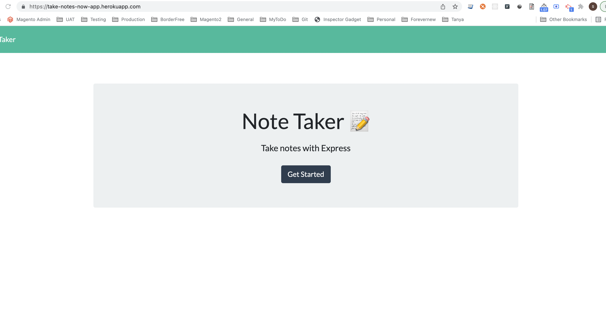

# Note Taker

[Application URL  ](https://take-notes-now-app.herokuapp.com/notes) 

[Repository URL ](https://github.com/SanjeevKumar-DEV/Note-Taker)

## Description

> This is server oriented application with API 
> routes and default pages. This application 
> helps to take new note, retrieve all 
> existing notes or a single note and delete 
> an existing note. 

## Table of Contents

- [Installation](#Installation)
- [Usage](#Usage)
- [Contributing](#Contributing)
- [Tests](#Tests)
- [Questions](#Questions)
- [License](#License)

## Installation

Go to application URL as mentioned above.

## Usage

> Go the application URL 

 

> Retrieve All Existing Notes 

 

> Add New Note 

 

> Delete Note 

 

## Contributing

> Contribution guidelines development is in progress. 

 

## Tests

> Test Development strategy is in progress. 

## Questions

> Q1. What is my link to my github profile ? 
Answer: [Github Username](https://github.com/SanjeevKumar-DEV) 

> Q2. How to reach me with additional questions ? 
Answer: [Contact Email](mailto:sanjeevkumar@me.com)

## License

> License agreement is covered under guidelines and agreement of GitHub and Microsoft and Heroku
